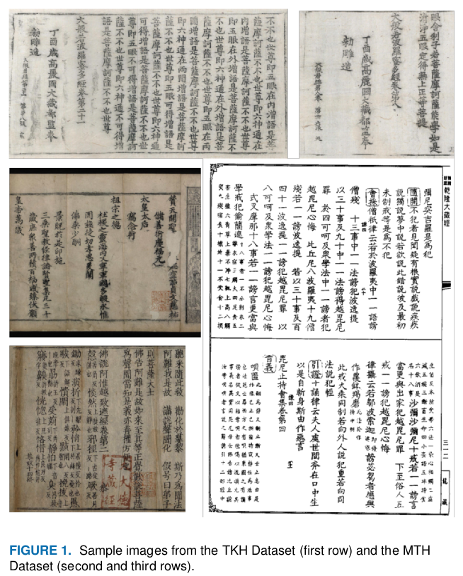
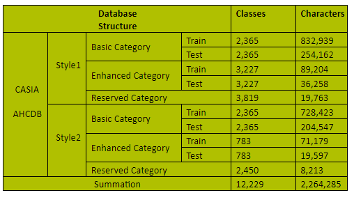
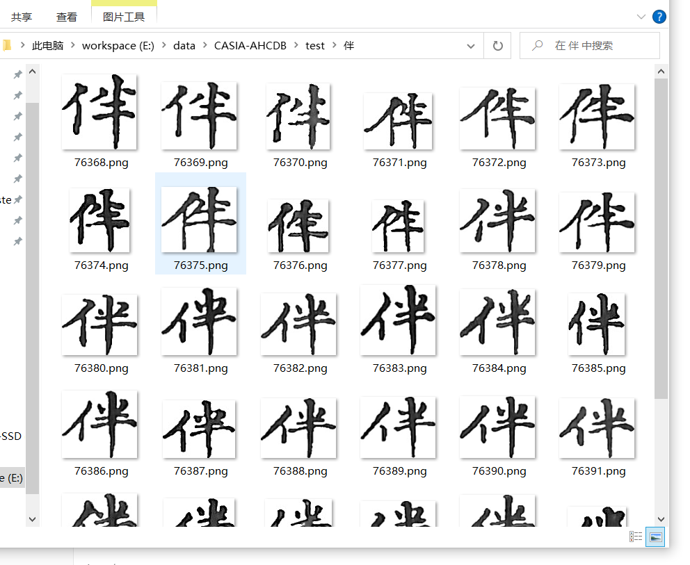
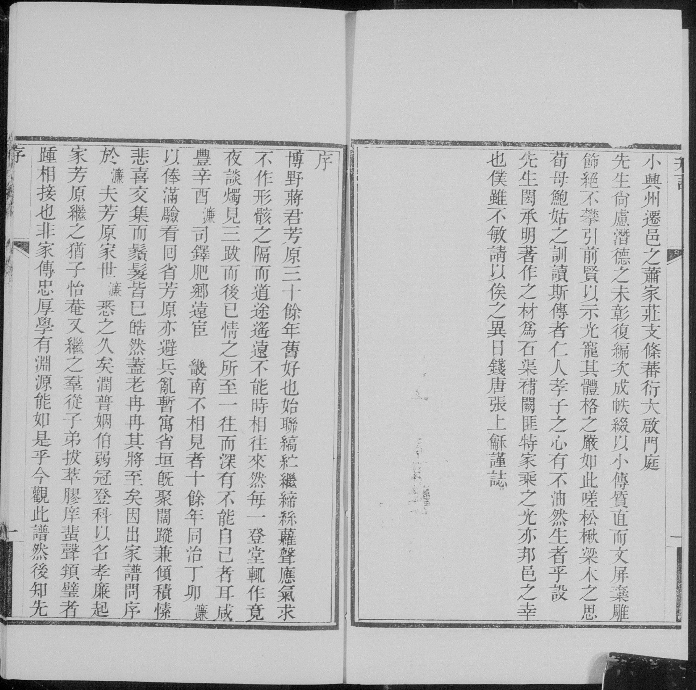
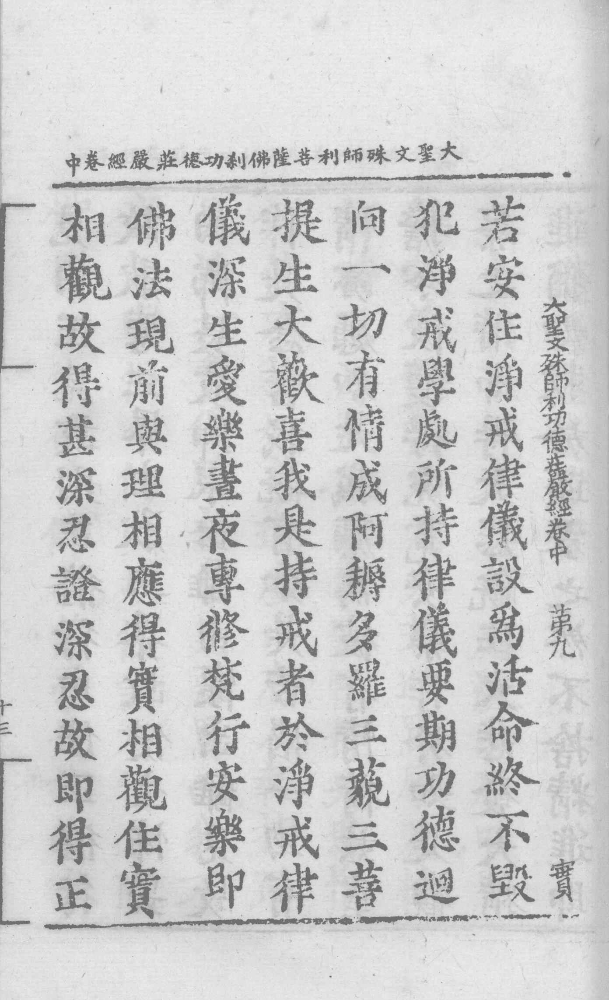

# Awesome Traditional Chinese Character Recognition

Papers, codes, datasets, talks and other things about
traditional character recognition
are present on this page.

## Papers

| Title                                                                                                                | Venue | Year | PDF                                                                    | CODE                                                                |
| -------------------------------------------------------------------------------------------------------------------- | ----- | ---- | ---------------------------------------------------------------------- | ------------------------------------------------------------------- |
| A Handwritten Chinese Text Recognizer Applying Multi-level Multimodal Fusion Network                                 | ICDAR | 2019 | [Link](https://ieeexplore.ieee.org/abstract/document/8978158)          |                                                                     |
| A Fast and Accurate Fully Convolutional Network for End-to-End Handwritten Chinese Text Segmentation and Recognition | ICDAR | 2019 | [Link](https://ieeexplore.ieee.org/abstract/document/8977956)          |                                                                     |
| Weakly Supervised Learning for Over-Segmentation Based Handwritten Chinese Text Recognition                          | ICFHR | 2020 | [Link](https://ieeexplore.ieee.org/abstract/document/9257785)          |                                                                     |
| Decoupled Attention Network for Text Recognition                                                                     | AAAI  | 2020 | [Link](https://arxiv.org/abs/1912.10205)                               | [Link](https://github.com/Wang-Tianwei/Decoupled-attention-network) |
| Towards fast, accurate and compact online handwritten Chinese text recognition                                       | ICDAR | 2021 | [Link](https://link.springer.com/chapter/10.1007/978-3-030-86334-0_11) |                                                                     |
| Searching from the prediction of visual and language model for handwritten Chinese text recognition                  | ICDAR | 2021 | [Link](https://link.springer.com/chapter/10.1007/978-3-030-86334-0_18) |                                                                     |
| Decoupled Attention Network for Text Recognition                                                                     | AAAI  | 2020 | [Link](https://arxiv.org/abs/1912.10205)                               | [Link](https://github.com/Wang-Tianwei/Decoupled-attention-network) |
| Recognition of Handwritten Chinese Text by Segmentation: A Segment-Annotation-Free Approach                          | TMM   | 2022 | [Link](https://ieeexplore.ieee.org/abstract/document/9695187)          |                                                                     |

## Codes & Frameworks

## Datasets

Most of the traditional chinese character recognition method usually conduct experiments on the datasets down below.

### TKH and MTH

Introduced by Yang et al. in [Dense and Tight Detection of Chinese Characters in Historical Documents: Datasets and a Recognition Guided Detector](https://ieeexplore.ieee.org/document/8364534).

The datasets contain scanned Tripitaka images with ground truth labels, including ground truth character bounding boxes and ground truth characters in each box.

#### Datasets Information

|                      | TKH     | MTH     |
| -------------------- | ------- | ------- |
| Pages                | 1,000   | 500     |
| Lines                | 23,471  | 17,178  |
| Character instances  | 323,491 | 197,886 |
| Character categories | 1,471   | 3,664   |

#### Datasets Samples

Download Link: https://github.com/HCIILAB/TKH_MTH_Datasets_Release

> Note: The TKH dataset and MTH dataset can only be used for **non-commercial** research purpose.

### CASIA-AHCDB

Introduced by Xu et al. in [CASIA-AHCDB: A Large-Scale Chinese Ancient Handwritten Characters Database](https://ieeexplore.ieee.org/document/8978010)

The dataset was built by annotating 11,937 pages of Chinese ancient handwritten documents. It consists of more than 2.2 million annotated handwritten character samples of 10,350 categories. According to the source of these documents, the database is divided into two datasets of different styles: Complete Library in Four Sections (AHCDB-style1) and Ancient Buddhist Scriptures (AHCDB-style2).

#### Dataset Information

#### Dataset Samples

Download Link: http://www.nlpr.ia.ac.cn/pal/CASIA-AHCDB.html
Extract Link(**Not official**): https://github.com/detachment8/CASIA-AHCDB-load

### ICDAR2019-HDRC-Chinese

Introduced by Rajkumar Saini et al. in [ICDAR 2019 Historical Document Reading Challenge on Large Structured Chinese Family Records](https://tc11.cvc.uab.es/datasets/ICDAR2019HDRC_1)

#### Dataset Information

The dataset is provided by [FamilySearch](https://www.familysearch.org/) and consists of the following collections:

training set: consists of in total 11,715 images selected from another set of 37 separate books.

test set: consists of in total 1,135 images selected from 12 separate books,

#### Dataset Samples

Download Link: https://tc11.cvc.uab.es/datasets/ICDAR2019HDRC_1
Ground Truth Download Link: https://tc11.cvc.uab.es/datasets/ICDAR2019HDRC_1/gt_1_1

### 古籍文档图像分析与识别数据集

Introduced by "粤港澳大湾区（黄埔）国际算法算例大赛-古籍文档图像识别与分析算法比赛" as the competition dataset.

#### Dataset Information

#### Dataset Samples

## Talks

## Competitions

### 粤港澳大湾区（黄埔）国际算法算例大赛-古籍文档图像识别与分析算法比赛

Link: https://www.cvmart.net/race/10340/base

Datasets Download Link: https://iacc.pazhoulab-huangpu.com/dataset/41.html

> Highest Score 
> Team: 大佬吃维C (SCUT-DLVClab)
> Recognition Method: [Segmentation-Based](https://ieeexplore.ieee.org/abstract/document/9695187)
> Recognition Accuracy: 91.43% 
> Inference Speed: 505.61ms
> Model Parameters: 187.76M

### ICDAR 2019 Historical Document Reading Challenge Task 1

Link: https://ieeexplore.ieee.org/document/8977999/footnotes#footnotes-id-fn1

Datasets Download Link: https://tc11.cvc.uab.es/datasets/ICDAR2019HDRC_1

> Highest Score 
> Team: SCUT-DLVClab
> Recognition Method: CRNN-based
> Edit Distance:  2539
> Perfect Match: 40517
> Error Rate: 1%
> Perfect Match Ratio: 95%

## Acknowledgements